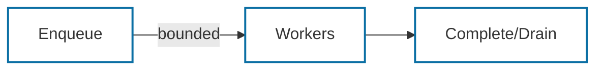
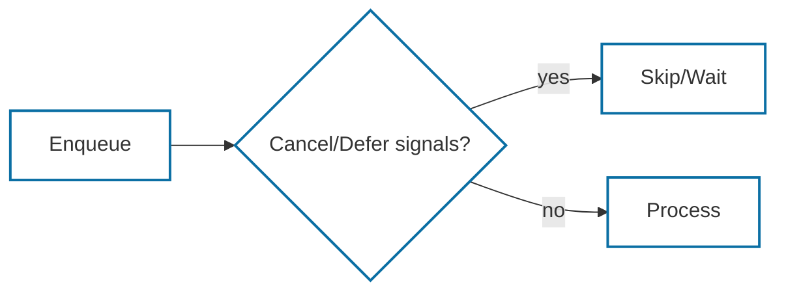
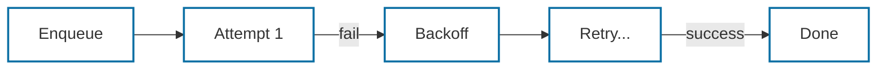

# Ephemeral Atoms

Small, opinionated wrappers around Ephemeral coordinators. Each atom has:
- A single-purpose API
- A focused test under `Mostlylucid.Test/Ephemeral/Atoms/`
- A short usage snippet here

---

## FixedWorkAtom
- File: `FixedWorkAtom.cs`
- Test: `FixedWorkAtomTests.cs`
- What: Fixed-concurrency work queue with simple stats/snapshot. Use when you need a lightweight, bounded worker pool without per-key ordering.

Diagram:


Usage:
```csharp
await using var atom = new FixedWorkAtom<int>(
    async (item, ct) => await ProcessAsync(item, ct),
    maxConcurrency: 4);

await atom.EnqueueAsync(1);
await atom.DrainAsync();
```

## KeyedSequentialAtom
- File: `KeyedSequentialAtom.cs`
- Test: `KeyedSequentialAtomTests.cs`
- What: Per-key ordering with global parallelism; optional fair scheduling. Use when a key (user, tenant, resource) must run in order while other keys proceed in parallel.

Diagram:
```mermaid
flowchart LR
    A[Enqueue (key)] --> B{Key switch}
    B -->|Key A| C[Seq A]
    B -->|Key B| D[Seq B]
    C --> E[Drain]
    D --> E
    classDef accent stroke:#0b6fa4,fill:none,stroke-width:2px;
    class A,B,C,D,E accent;
```

Usage:
```csharp
await using var atom = new KeyedSequentialAtom<(string Key, int Value), string>(
    item => item.Key,
    async (item, ct) => await HandleAsync(item, ct),
    maxConcurrency: 8,
    perKeyConcurrency: 1);

await atom.EnqueueAsync(("user-1", 1));
await atom.DrainAsync();
```

## SignalAwareAtom
- File: `SignalAwareAtom.cs`
- Test: `SignalAwareAtomTests.cs`
- What: Enqueue guard that cancels/defers based on ambient signals (glob patterns), seedable via `Raise`. Use for circuit breakers, maintenance modes, or pausing intake from signal feedback.

Diagram:


Usage:
```csharp
var cancelOn = new HashSet<string> { "circuit-open" };
await using var atom = new SignalAwareAtom<int>(DoWorkAsync, cancelOn: cancelOn);
atom.Raise("circuit-open"); // block intake
await atom.EnqueueAsync(1);  // returns -1 when cancelled
await atom.DrainAsync();
```

## BatchingAtom
- File: `BatchingAtom.cs`
- Test: `BatchingAtomTests.cs`
- What: Buffers items and flushes on size or interval. Use to coalesce many small items into efficient batches with minimal timers/allocations.

Diagram:


Usage:
```csharp
await using var atom = new BatchingAtom<string>(
    async (batch, ct) => await SendBatchAsync(batch),
    maxBatchSize: 50,
    flushInterval: TimeSpan.FromSeconds(1));

atom.Enqueue("a");
atom.Enqueue("b");
// flushes on size or time
```

## RetryAtom
- File: `RetryAtom.cs`
- Test: `RetryAtomTests.cs`
- What: Wraps work with retry/backoff semantics. Use to make transient operations resilient with bounded attempts and configurable backoff.

Diagram:


Usage:
```csharp
await using var atom = new RetryAtom<int>(
    async (item, ct) => await CallAsync(item, ct),
    maxAttempts: 5,
    backoff: attempt => TimeSpan.FromMilliseconds(25 * attempt));

await atom.EnqueueAsync(42);
await atom.DrainAsync();
```

## ControlledFanOut
- File: `Examples/ControlledFanOut.cs`
- Test: `Examples/ControlledFanOutTests.cs`
- What: Bounded global fan-out with per-key limits. Use when you must cap total fan-out while keeping per-key ordering (e.g., tenant workloads).

Diagram:
```mermaid
flowchart LR
    A[Enqueue (key)] --> B{Global gate}
    B --> C{Key gate}
    C --> D[Process]
    classDef accent stroke:#0b6fa4,fill:none,stroke-width:2px;
    class A,B,C,D accent;
```

Usage:
```csharp
await using var fanout = new ControlledFanOut<string, Job>(
    job => job.Key,
    async (job, ct) => await HandleAsync(job, ct),
    maxGlobalConcurrency: 8,
    perKeyConcurrency: 1);

await fanout.EnqueueAsync(new Job("user-1", payload));
await fanout.DrainAsync();
```

### Reactive Fan-Out
- File: `Examples/ReactiveFanOutPipeline.cs`
- Test: `Examples/ReactiveFanOutPipelineTests.cs`
- What: Upstream fan-out that throttles dynamically when downstream signals backpressure or errors. Use when stage 1 must react to downstream stress without extra queues.
